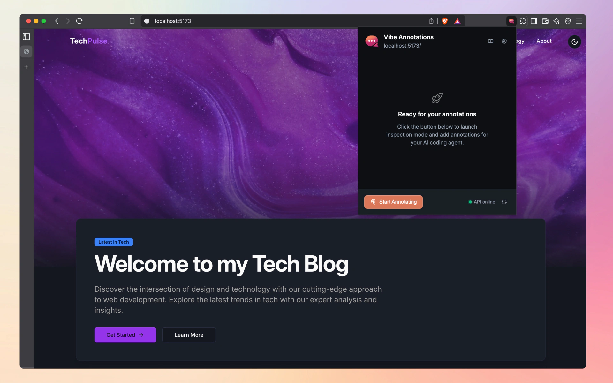
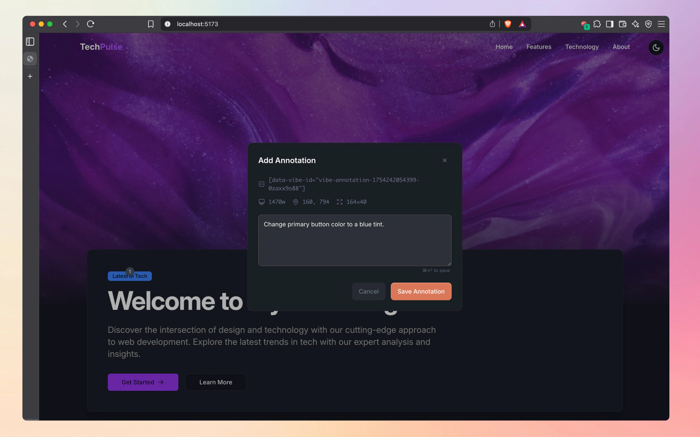
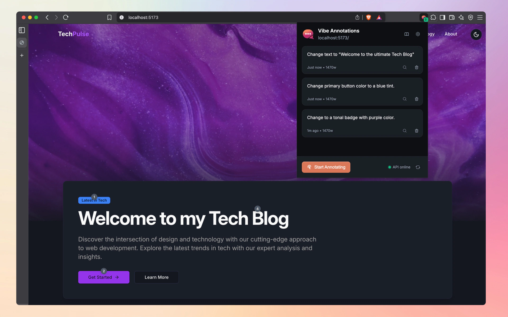
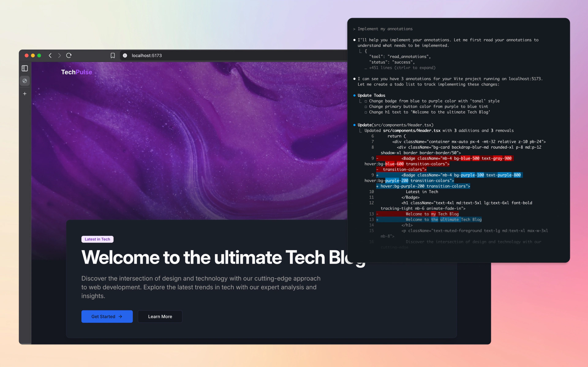

# Vibe Annotations

[](https://opensource.org/licenses/MIT)
[](https://chrome.google.com/webstore)
[](https://www.npmjs.com/package/vibe-annotations-server)
[](CONTRIBUTING.md)

AI-powered development annotations for localhost projects. Drop comments on your localhost apps and let your AI coding agent implement the fixes automatically.

## How it Works


*1. Extension popup shows setup instructions and current page status*


*2. Click elements on your localhost page to create annotations with feedback*


*3. Manage all your annotations from the extension popup*


*4. AI coding agents automatically implement your requested fixes*

## Features

- 🏠 **Localhost-focused**: Works on your development projects
- 🤖 **AI-powered**: Integrates with AI coding agents via MCP
- ⚡ **Instant feedback**: Click, comment, bulk-fix
- 👨‍💻 **Developer-friendly**: Built for modern web development

## Architecture

Vibe Annotations uses a two-piece architecture:

1. **Browser Extension** (`/extension`): UI, setup guidance, annotation management
2. **NPM Package** (`vibe-annotations-server`): MCP server, local HTTP API, data storage

## Quick Start

### 1. Install the Browser Extension
Install the `vibe-annotations` extension from the Chrome Web Store.

### 2. Install the Global Server
```bash
npm install -g git+https://github.com/RaphaelRegnier/vibe-annotations-server.git
```

### 3. Start the Server
```bash
vibe-annotations-server start
```

### 4. Connect Your AI Coding Agent
Choose your AI coding agent and follow the setup:

#### Claude Code
In your project directory:
```bash
claude mcp add --transport sse vibe-annotations http://127.0.0.1:3846/sse
```

#### Cursor
1. Open Cursor → Settings → Cursor Settings
2. Go to the Tools & Integrations tab
3. Click + Add new global MCP server
4. Add this configuration:
```json
{
  "mcpServers": {
    "vibe-annotations": {
      "url": "http://127.0.0.1:3846/sse"
    }
  }
}
```

#### Windsurf
1. Navigate to Windsurf → Settings → Advanced Settings
2. Scroll down to the Cascade section
3. Add this configuration:
```json
{
  "mcpServers": {
    "vibe-annotations": {
      "serverUrl": "http://127.0.0.1:3846/sse"
    }
  }
}
```

#### VS Code
Install an AI extension that supports MCP, then add this configuration to your MCP settings:
```json
{
  "mcpServers": {
    "vibe-annotations": {
      "type": "sse",
      "url": "http://127.0.0.1:3846/sse"
    }
  }
}
```

### 5. Start Using Annotations
- Open the extension popup for detailed setup instructions
- Start annotating your localhost projects!
- Use your AI coding agent to automatically implement fixes

## User Experience Flow

1. **Extension Installation**: Install from Chrome Web Store
2. **Setup Instructions**: Extension popup guides through terminal setup
3. **Server Detection**: Extension automatically detects running server
4. **Daily Usage**: Create annotations → Use your AI coding agent → Fixes implemented

## Server Management

```bash
# Check server status
vibe-annotations-server status

# Stop server
vibe-annotations-server stop

# Restart server
vibe-annotations-server restart
```

## Development

See `/extension` directory for browser extension development. The server package will be published separately as `vibe-annotations-server`.

## Troubleshooting

Having issues? Check our [GitHub Issues](https://github.com/RaphaelRegnier/vibe-annotations/issues) or create a new one.

### Common Issues

- **Server not detected**: Make sure the server is running with `vibe-annotations-server status`
- **Extension not working**: Check that you're on a localhost URL (localhost, 127.0.0.1, or 0.0.0.0)
- **MCP connection failed**: Verify your AI coding agent configuration matches the examples above

## Contributing

We love contributions! Please see our [Contributing Guidelines](CONTRIBUTING.md) for details.

### Contributors

Thanks to everyone who has contributed to making Vibe Annotations better!

<!-- ALL-CONTRIBUTORS-LIST:START - Do not remove or modify this section -->
<!-- ALL-CONTRIBUTORS-LIST:END -->

## License

MIT - see [LICENSE](LICENSE) for details