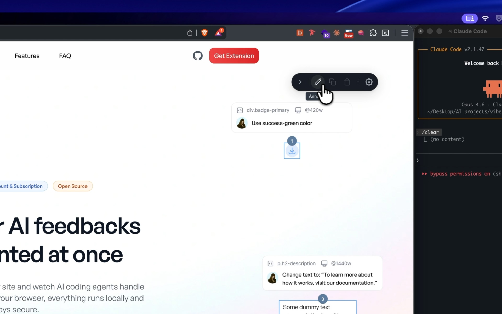
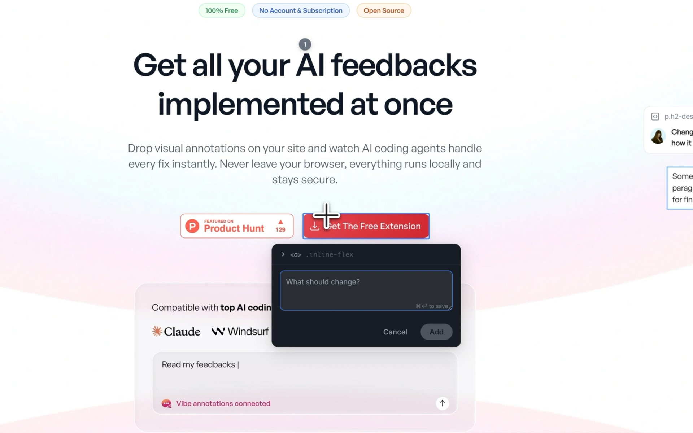
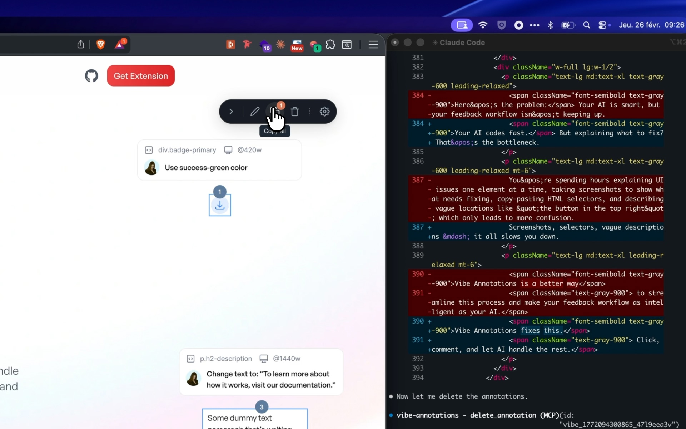
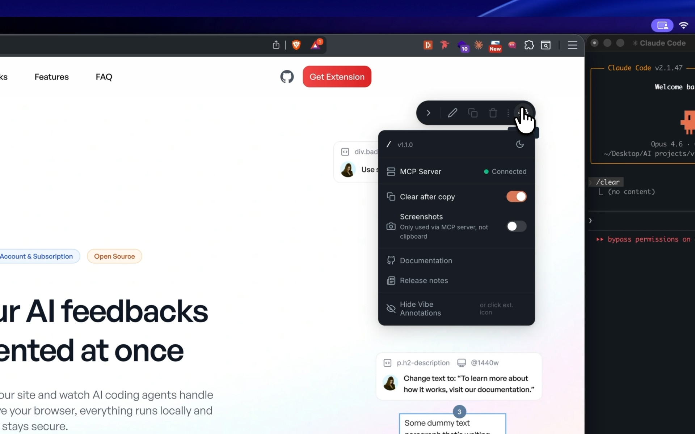
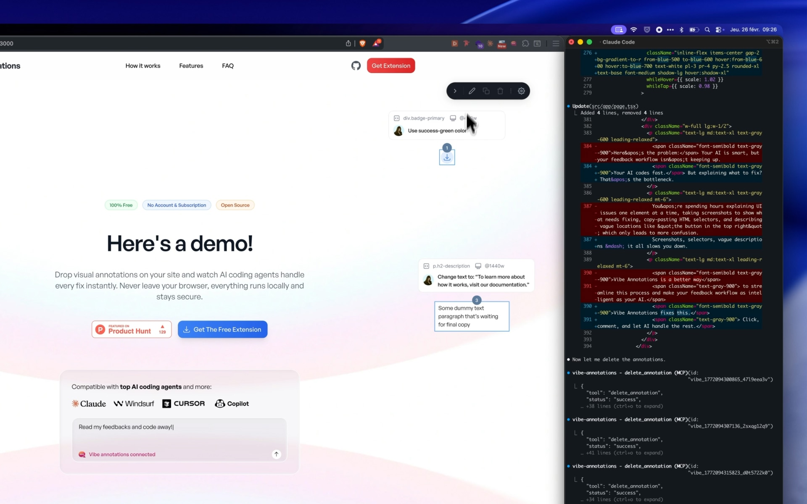

# Vibe Annotations

[](https://polyformproject.org/licenses/shield/1.0.0)
[](https://chrome.google.com/webstore)
[](https://www.npmjs.com/package/vibe-annotations-server)
[](CONTRIBUTING.md)

Website: https://www.vibe-annotations.com/

Drop visual comments on your localhost apps and let AI coding agents implement the fixes. Click elements, leave feedback, tweak styles — your agent picks it all up via MCP.

https://github.com/user-attachments/assets/4c134852-090b-4974-85e5-be77a95636f9

## How it Works


*1. Open your localhost app and click "Annotate" in the floating toolbar*


*2. Click any element — leave a comment, edit text, or tweak styles directly*


*3. Copy annotations to clipboard, or let your agent fetch them automatically via MCP*


*4. Settings: MCP server status and setup, clear-after-copy, screenshots, theme toggle*


*5. AI agent implements fixes and deletes annotations — all from your browser*

## Features

- **Annotate anything**: Click elements to leave comments, edit text, and tweak CSS (font size, colors, layout, spacing) with live preview
- **Watch mode**: Tell your agent "Start watching Vibe Annotations" — it picks up annotations as you drop them, implements changes, and loops. Hands-free
- **Multi-page**: Annotate across routes, then bulk-process everything at once
- **Collaborate**: Export annotations as JSON, share with teammates, import on their localhost with automatic URL remapping
- **Agent bridge API**: Browser-based agents (Claude Chrome extension, OpenClaw) can create annotations via `window.__vibeAnnotations`
- **Keyboard-driven**: Enter to select elements, arrow keys to navigate siblings, hotkey to toggle annotation mode
- **Local only**: Works on localhost, .local, .test, .localhost, and file:// URLs. No data leaves your machine

## Architecture

Vibe Annotations uses a two-piece architecture:

1. **Browser Extension** (`/extension`): UI, annotation management, live design previews
2. **NPM Package** (`vibe-annotations-server`): MCP server, HTTP API, data storage

```
Browser Extension ←→ HTTP API ←→ Server ←→ MCP ←→ AI Coding Agents
```

## Quick Start

### 1. Install the Browser Extension

**From Chrome Web Store:**
Install from the [Chrome Web Store](https://chromewebstore.google.com/detail/gkofobaeeepjopdpahbicefmljcmpeof)

**For Development:**
Go to your chromium browser extension page, and click "Load unpacked" then select /extension directory.

### 2. Install the Global Server
```bash
npm install -g vibe-annotations-server
```

### 3. Start the Server
```bash
vibe-annotations-server start
```

### 4. Connect Your AI Coding Agent
Choose your AI coding agent and follow the setup:

#### Claude Code
In your project directory:
```bash
# Recommended (HTTP transport - more stable)
claude mcp add --transport http vibe-annotations http://127.0.0.1:3846/mcp

# Alternative (SSE transport - for compatibility)
claude mcp add --transport sse vibe-annotations http://127.0.0.1:3846/sse
```

#### Cursor
1. Open Cursor → Settings → Cursor Settings
2. Go to the Tools & Integrations tab
3. Click + Add new global MCP server
4. Add this configuration:
```json
{
  "mcpServers": {
    "vibe-annotations": {
      "url": "http://127.0.0.1:3846/mcp"
    }
  }
}
```

**Alternative (SSE transport):**
```json
{
  "mcpServers": {
    "vibe-annotations": {
      "url": "http://127.0.0.1:3846/sse"
    }
  }
}
```

#### Windsurf
1. Navigate to Windsurf → Settings → Advanced Settings
2. Scroll down to the Cascade section
3. Add this configuration:
```json
{
  "mcpServers": {
    "vibe-annotations": {
      "serverUrl": "http://127.0.0.1:3846/mcp"
    }
  }
}
```

**Alternative (SSE transport):**
```json
{
  "mcpServers": {
    "vibe-annotations": {
      "serverUrl": "http://127.0.0.1:3846/sse"
    }
  }
}
```

#### Codex
Add to `~/.codex/config.toml`:
```toml
[mcp_servers.vibe-annotations]
url = "http://127.0.0.1:3846/mcp"
```

#### OpenClaw
Add to `~/.openclaw/openclaw.json`:
```json
{
  "mcpServers": {
    "vibe-annotations": {
      "url": "http://127.0.0.1:3846/mcp"
    }
  }
}
```

#### VS Code
Install an AI extension that supports MCP, then add this configuration to your MCP settings:
```json
{
  "mcpServers": {
    "vibe-annotations": {
      "url": "http://127.0.0.1:3846/mcp"
    }
  }
}
```

### 5. Start Annotating

Open a localhost page, click **Annotate** in the toolbar, and click any element to leave feedback. Then either:

- **Copy & paste**: Click **Copy** in the toolbar and paste into any AI chat
- **MCP (automatic)**: Tell your agent to read and implement vibe annotations
- **Watch mode (hands-free)**: Tell your agent "Start watching Vibe Annotations" — it loops automatically

### 6. (Optional) Enable Local File Support

To annotate local HTML files (file:// URLs) instead of localhost:

1. Go to `chrome://extensions/`
2. Find "Vibe Annotations" and click "Details"
3. Enable "Allow access to file URLs"
4. Refresh your local HTML file

**Note:** This is only needed for local files. Localhost development servers work without this step.

## Watch Mode

Watch mode lets your agent automatically pick up and implement annotations as you drop them.

1. Make sure the MCP server is running and connected
2. Tell your agent: **"Start watching Vibe Annotations"**
3. Annotate elements in the browser — the agent picks them up, implements changes, and deletes them
4. An eye icon replaces the copy button while an agent is watching. Click the eye to stop
5. Auto-stops after 5 minutes of inactivity

The agent calls `watch_annotations` in a loop under the hood — it polls every 10 seconds for new annotations matching the localhost URL you're working on.

## MCP Tools

The server exposes these tools to connected agents:

| Tool | Description |
|------|-------------|
| `read_annotations` | Retrieve pending annotations with URL filtering and pagination |
| `watch_annotations` | Long-poll for new annotations (used in watch mode loops) |
| `delete_annotation` | Remove an annotation after implementing the fix |
| `delete_project_annotations` | Batch delete all annotations for a project URL |
| `get_project_context` | Infer framework and tech stack from a localhost URL |
| `get_annotation_screenshot` | Get screenshot data for visual context |

## Workflows

### Single page — copy & paste
Annotate a few elements, click **Copy**, paste into any AI chat. Enable **Clear after copy** in settings to auto-delete after copying.

### Multi-page — MCP server
Annotate across routes, then tell your agent to read and implement all annotations. The agent pulls everything via MCP, implements fixes, and deletes each annotation when done.

### Collaboration — export & import
A reviewer exports annotations as JSON and shares the file. A developer imports them on their localhost — URLs are automatically remapped.

### Watch mode — hands-free
Tell your agent "Start watching Vibe Annotations". Annotate at your own pace — the agent picks up each annotation as it appears, implements the change, and deletes it.

## Server Management

```bash
# Check server status
vibe-annotations-server status

# Stop server
vibe-annotations-server stop

# Restart server
vibe-annotations-server restart
```

## Uninstallation

To completely remove Vibe Annotations from your system:

### 1. Remove MCP Server from Your AI Coding Agent

#### Claude Code
```bash
claude mcp remove vibe-annotations
```

#### Cursor
Go to Cursor → Settings → Cursor Settings → Tools & Integrations tab and remove the vibe-annotations server configuration.

#### Windsurf
Go to Windsurf → Settings → Advanced Settings → Cascade section and remove the vibe-annotations server from your MCP configuration.

#### Other Editors
Remove the vibe-annotations server from your editor's MCP configuration settings.

### 2. Uninstall the Global Server
```bash
npm uninstall -g vibe-annotations-server
```

### 3. Remove Data Files
```bash
rm -rf ~/.vibe-annotations
```

### 4. Remove Browser Extension
Go to Chrome Extensions (`chrome://extensions/`) and remove the Vibe Annotations extension.

## Development

### Local Server Development (Advanced)

If you're developing Vibe Annotations or prefer to run the server locally instead of the global installation:

```bash
# Clone the repository
git clone https://github.com/RaphaelRegnier/vibe-annotations.git
cd vibe-annotations/annotations-server

# Install dependencies
npm install

# Run the server locally
npm run start
# or for development with auto-restart:
npm run dev
```

**Note**: Running locally ties the server to this specific directory. Most users should use the global installation method shown above.

### Extension Development

See `/extension` directory for browser extension development. Load the extension in Chrome as unpacked extension.

## Documentation

- **[Update System](docs/UPDATE_SYSTEM.md)** - Comprehensive guide to extension and server update notifications
- **[Development Guide](docs/DEVELOPMENT.md)** - Development setup and guidelines

## Troubleshooting

Having issues? Check our [GitHub Issues](https://github.com/RaphaelRegnier/vibe-annotations/issues) or create a new one.

### Common Issues

- **Server not detected**: Make sure the server is running with `vibe-annotations-server status`
- **Extension not working**: Check that you're on a local development URL (localhost, 127.0.0.1, 0.0.0.0, *.local, *.test, *.localhost)
- **MCP connection failed**: Verify your AI coding agent configuration matches the examples above
- **SSE connection drops/timeouts**: If experiencing "TypeError: terminated" or frequent disconnections, switch to HTTP transport (replace `/sse` with `/mcp` in your configuration)

## Contributing

We love contributions! Please see our [Contributing Guidelines](CONTRIBUTING.md) for details.

### Contributors

Thanks to everyone who has contributed to making Vibe Annotations better!

<!-- ALL-CONTRIBUTORS-LIST:START - Do not remove or modify this section -->
<!-- ALL-CONTRIBUTORS-LIST:END -->

## License

[PolyForm Shield 1.0.0](https://polyformproject.org/licenses/shield/1.0.0) — see [LICENSE](LICENSE) and [NOTICE](NOTICE) for details. Versions prior to v1.5.0 were released under MIT.
