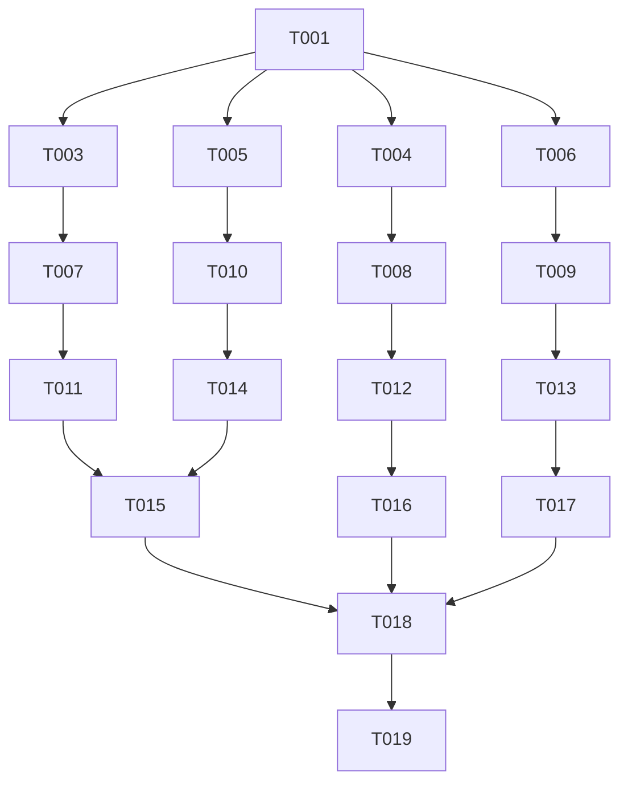

# Tasks: MCP Server Enhancement

**Input**: Design documents from `/specs/001-mcp-server-enhancement/`
**Prerequisites**: plan.md (required), research.md, data-model.md, contracts/mcp-tools.json

## Execution Flow (main)

```text
1. Load plan.md from feature directory
   → Extract: Node.js ES Modules, Express.js, @modelcontextprotocol/sdk
2. Load design documents:
   → data-model.md: Enhanced Annotation entity with status
   → contracts/mcp-tools.json: 4 MCP tools (read_annotations, update_annotation_status, bulk_update_status, get_annotation_screenshot)
   → quickstart.md: Validation scenarios
3. Generate tasks by category:
   → Setup: Backup existing server.js
   → Tests: Tool validation tests
   → Core: MCP tool implementations
   → Integration: Tool registration and handlers
   → Polish: Performance validation, documentation
4. Apply task rules:
   → All in same file (server.js) = sequential
   → Test files can be parallel [P]
5. Number tasks T001-T019
6. All tasks focus on annotations-server/lib/server.js
7. Return: SUCCESS (tasks ready for execution)
```

## Format: `[ID] [P?] Description`

- **[P]**: Can run in parallel (different files, no dependencies)
- Include exact file paths in descriptions

## Path Conventions

- Server code: `annotations-server/lib/server.js`
- Test utilities: `annotations-server/test/` (if needed)
- All changes are in the existing Node.js MCP server

## Phase 3.1: Setup

- [x] T001 Create test data file with sample annotations at annotations-server/test/test-data.json (A real world example can be copied from `~/.vibe-annotations/annotations.json`)
- [x] T002 [P] Document existing MCP tool structure in annotations-server/lib/server.js (lines 353-435)

## Phase 3.2: Tests First (TDD) ⚠️ MUST COMPLETE BEFORE 3.3

- [x] T003 [P] Create test for update_annotation_status tool in annotations-server/test/test-status-update.js
- [x] T004 [P] Create test for bulk_update_status tool in annotations-server/test/test-bulk-update.js
- [x] T005 [P] Create test for pagination (offset parameter) in annotations-server/test/test-pagination.js
- [x] T006 [P] Create test for screenshot optimization in annotations-server/test/test-screenshot.js

## Phase 3.3: Core Features (Tools)

- [ ] T007 Add update_annotation_status tool definition to tool list (server.js lines 355-433)
- [ ] T008 Add bulk_update_status tool definition to tool list (server.js lines 355-433)
- [ ] T009 Add get_annotation_screenshot tool definition to tool list (server.js lines 355-433)
- [ ] T010 Enhance read_annotations tool definition with offset parameter (server.js line 356)

## Phase 3.4: Implementation (Handlers)

- [ ] T011 Implement updateAnnotationStatus method in server.js (after line 714)
- [ ] T012 Implement bulkUpdateStatus method in server.js (after line 714)
- [ ] T013 Implement getAnnotationScreenshot method in server.js (after line 714)
- [ ] T014 Enhance readAnnotations method to support offset and strip screenshots (server.js lines 649-714)

## Phase 3.5: Integration (Wire up handlers)

- [ ] T015 Add handler case for update_annotation_status in CallToolRequestSchema (server.js lines 437-523)
- [ ] T016 Add handler case for bulk_update_status in CallToolRequestSchema (server.js lines 437-523)
- [ ] T017 Add handler case for get_annotation_screenshot in CallToolRequestSchema (server.js lines 437-523)

## Phase 3.6: Polish & Validation

- [ ] T018 [P] Run manual validation tests from quickstart.md
- [ ] T019 [P] Update package.json version to reflect new features

## Task Dependencies



## Parallel Execution Examples

### After T001 completes, run tests in parallel

```bash
# These can all run simultaneously as they're different files
Task agent T003 &  # test-status-update.js
Task agent T004 &  # test-bulk-update.js
Task agent T005 &  # test-pagination.js
Task agent T006 &  # test-screenshot.js
wait
```

### Sequential implementation required

```bash
# These modify the same file (server.js) so must be sequential
Task agent T007  # Add update_annotation_status tool
Task agent T008  # Add bulk_update_status tool
Task agent T009  # Add get_annotation_screenshot tool
Task agent T010  # Enhance read_annotations tool
```

### Final validation can be parallel

```bash
Task agent T018 &  # Run validation tests
Task agent T019 &  # Update version
wait
```

## Implementation Notes

### Critical Implementation Details

1. **Backward Compatibility**: The existing read_annotations tool must continue working for older clients
2. **Screenshot Stripping**: In T015, ensure screenshot data is replaced with has_screenshot boolean
3. **Atomic Updates**: In T012-T013, use the existing saveAnnotations method for atomic writes
4. **Error Handling**: Return appropriate HTTP-like status codes in MCP responses
5. **Validation**: Status must be one of: pending, completed, archived

### File Modification Guide

- **Tool Definitions**: Lines 355-433 in server.js
- **Tool Handlers**: Lines 437-523 in server.js
- **Helper Methods**: After line 714 in server.js
- **Existing Methods**: readAnnotations (649-714), saveAnnotations (564-624)

### Performance Targets

- Single status update: <10ms
- Bulk update (10 items): <20ms
- Read with pagination: <5ms
- Screenshot retrieval: <10ms

## Success Criteria

✅ All test files pass (T004-T007)
✅ All 4 MCP tools registered and callable
✅ Pagination works with offset parameter
✅ Screenshots excluded from list responses
✅ Status updates persist to disk
✅ Backward compatibility maintained
✅ Performance targets met

## Next Steps After Completion

1. Test with real AI agents (Claude Code, Cursor)
2. Update deployment documentation
3. Create migration guide if needed
4. Announce feature availability
